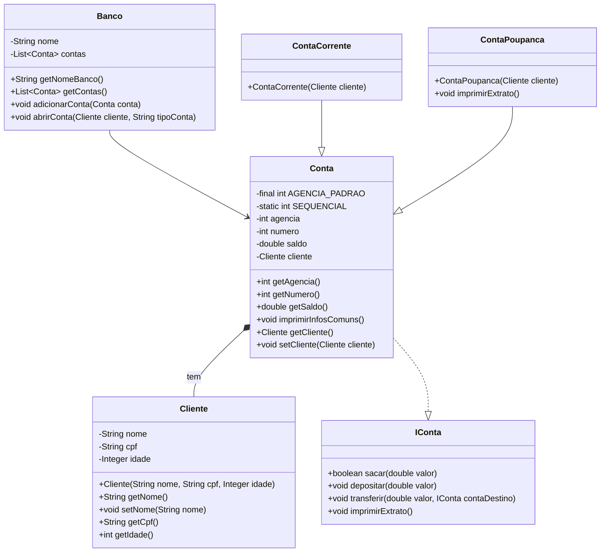

```mermaid
classDiagram
    
    class Banco {
        -String nome
        -List~Conta~ contas
        +String getNomeBanco()
        +List~Conta~ getContas()
        +void adicionarConta(Conta conta)
        +void abrirConta(Cliente cliente, String tipoConta)
    }

    class Cliente {
        -String nome
        -String cpf
        -Integer idade
        +Cliente(String nome, String cpf, Integer idade)
        +String getNome()
        +void setNome(String nome)
        +String getCpf()
        +int getIdade()
    }

    class Conta {
        -final int AGENCIA_PADRAO
        -static int SEQUENCIAL
        -int agencia
        -int numero
        -double saldo
        -Cliente cliente
        +int getAgencia()
        +int getNumero()
        +double getSaldo()
        +void imprimirInfosComuns()
        +Cliente getCliente()
        +void setCliente(Cliente cliente)
    }

    class ContaCorrente {
        +ContaCorrente(Cliente cliente)
    }

    class ContaPoupanca {
        +ContaPoupanca(Cliente cliente)
        +void imprimirExtrato()
    }

    class IConta {
        +boolean sacar(double valor)
        +void depositar(double valor)
        +void transferir(double valor, IConta contaDestino)
        +void imprimirExtrato()
    }

    Banco --> Conta
    Conta *-- Cliente : tem
    ContaCorrente --|> Conta
    ContaPoupanca --|> Conta
    Conta ..|> IConta
```