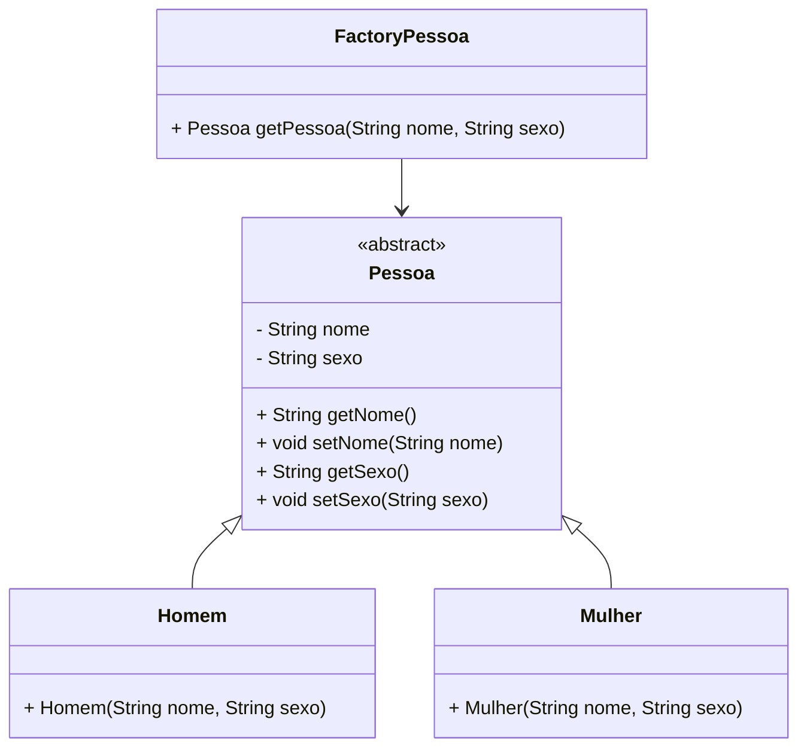

```mermaid
classDiagram

    class Pessoa {
        <<abstract>>
        - String nome
        - String sexo
        + String getNome()
        + void setNome(String nome)
        + String getSexo()
        + void setSexo(String sexo)
    }

    class FactoryPessoa {
        + Pessoa getPessoa(String nome, String sexo)
    }
    
    class Homem {
        + Homem(String nome, String sexo)
    }
    
    class Mulher {
        + Mulher(String nome, String sexo)
    }

    Pessoa <|-- Homem
    Pessoa <|-- Mulher
    FactoryPessoa --> Pessoa
```